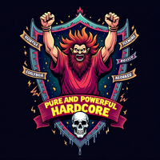

# 👋 Hi there, I'm BoozeLee

## 🚀 About Me

I'm a passionate **AI Developer** and **Machine Learning Engineer** focused on creating innovative solutions that bridge the gap between cutting-edge technology and real-world applications. My expertise spans across artificial intelligence, neuromorphic computing, and advanced data analytics.

### 🎯 What I Do
- **AI Development**: Building intelligent systems and frameworks
- **Machine Learning**: Developing predictive models and algorithms
- **Data Analytics**: Transforming data into actionable insights
- **Open Source**: Contributing to the developer community
- **Research**: Exploring emerging technologies and methodologies

## 🛠️ Tech Stack

## 🏆 Featured Projects

### 🤖 [AI Development Framework](https://github.com/BoozeLee/ai-development-framework)
A comprehensive AI development and orchestration framework with multi-environment support, advanced AI orchestrator, and production deployment capabilities.

### 🏢 [Bakery Street Project](https://github.com/Bakery-street-projct)
Leading innovative AI solutions and research initiatives in a sponsored organization environment.

## 📈 Current Focus

### 🔬 Research Areas
- **Neuromorphic Computing**: Brain-inspired AI architectures
- **Advanced AI Orchestration**: Multi-agent systems and crew management
- **Edge AI**: Deploying AI models on edge devices
- **Quantum Machine Learning**: Exploring quantum computing applications

### 🚀 Active Projects
- **AI Development Framework**: Production-ready AI orchestration platform
- **Neural Network Optimization**: Performance enhancement algorithms
- **Data Analytics Pipeline**: Real-time data processing systems
- **AI Ethics & Governance**: Responsible AI development frameworks

## 🤝 Let's Connect

[-000000?style=for-the-badge&logo=x&logoColor=white)](https://x.com/boozelee86)

## 💼 Professional Services

### 🎯 What I Offer
- **AI Consulting**: Strategic AI implementation guidance
- **Custom AI Solutions**: Tailored AI development services
- **Technical Mentoring**: AI/ML education and training
- **Open Source Contributions**: Community-driven development
- **Research Collaboration**: Academic and industry partnerships

## 💰 Monetization & Support

### 🎯 Revenue Streams
- **AI Consulting Services**: Strategic AI implementation and optimization
- **Custom AI Development**: Tailored solutions for businesses and organizations
- **Technical Training**: AI/ML workshops and educational programs
- **Code Reviews**: Expert code analysis and optimization
- **Project Management**: End-to-end AI project delivery

### 💳 Payment Methods
- **Bank Transfer**: Direct business payments
- **Cryptocurrency**: Bitcoin, Ethereum, and other major cryptocurrencies
- **Digital Payments**: PayPal, Stripe, and other secure payment platforms
- **Contract Agreements**: Professional service contracts

### 📊 Pricing Tiers
- **Basic Consultation**: $150/hour - Initial strategy and planning
- **Development Services**: $200/hour - Custom AI solution development
- **Project Management**: $250/hour - Full project lifecycle management
- **Enterprise Solutions**: Custom pricing for large-scale implementations

### 🤝 Collaboration Opportunities
- **Joint Ventures**: Partnership opportunities for AI projects
- **Research Funding**: Support for innovative AI research initiatives
- **Open Source Sponsorship**: Backing for community-driven projects
- **Educational Programs**: Sponsorship for AI education initiatives

## 🌟 Fun Facts

- 🧠 **Brain Enthusiast**: Fascinated by neuromorphic computing and brain-inspired AI
- 🎯 **Problem Solver**: Love tackling complex technical challenges
- 🌍 **Global Thinker**: Passionate about AI's impact on society
- 🚀 **Innovation Driver**: Always exploring cutting-edge technologies
- 🤝 **Community Builder**: Active in open source and developer communities

---

**Thanks for visiting my profile! Feel free to reach out for collaborations, discussions, or just to say hello! 👋**

*Let's build the future of AI together! 🚀*
